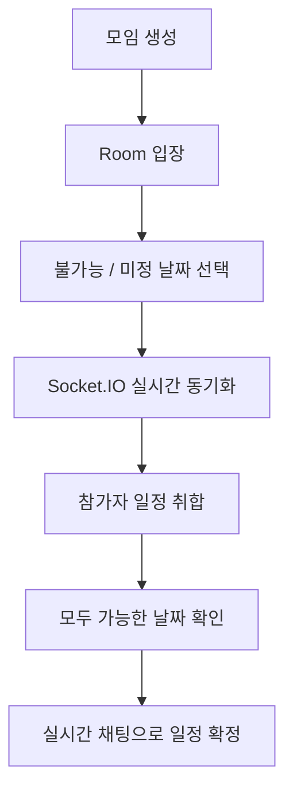
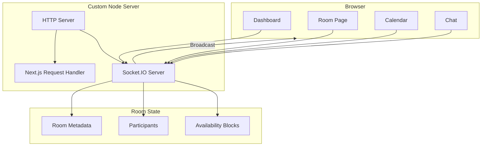
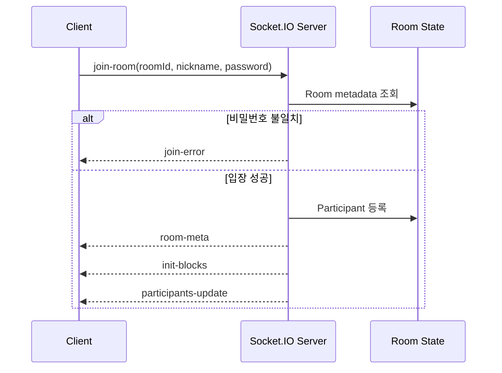
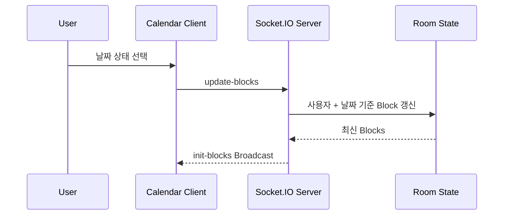

<div align="center">

# 🗓️ 언제모일까?

### 여러 사람의 불가능·미정 일정을 실시간으로 모아, 모두가 가능한 날짜를 빠르게 찾는 일정 조율 서비스

**Room-based Scheduling · Realtime Availability · Live Chat**


<br />

`Toy Project` · `Next.js App Router` · `Socket.IO` · `Custom Node Server`

</div>

---

## Overview

**언제모일까?**는 여러 사람이 각자의 일정을 하나씩 전달하고 다시 취합해야 하는 번거로움을 줄이기 위해 만든 실시간 일정 조율 서비스입니다.

모임마다 하나의 Room을 만들고 참가자가 캘린더에서 **불가능 / 미정** 날짜만 표시하면, 변경 내용이 같은 Room의 모든 사용자에게 즉시 동기화됩니다. 아무도 불가능하거나 미정으로 표시하지 않은 날짜는 **👑 모두 가능!** 상태로 한눈에 확인할 수 있습니다.



---

## My Role

**개인 프로젝트 — 기획, UI/UX, 프론트엔드 및 실시간 서버 구현**

- Next.js App Router 기반 Room Dashboard와 일정 조율 화면 구현
- Socket.IO 이벤트 기반 참가자·일정·채팅 실시간 동기화
- Next.js Request Handler와 Socket.IO를 통합한 Custom Node Server 구성
- 날짜·주 단위 일정 선택과 공통 가능일 계산 로직 구현
- CSS Modules 기반 반응형 게임 UI 설계

---

## At a Glance

| | |
| --- | --- |
| **Product** | 여러 참가자의 일정을 Room 단위로 취합하는 실시간 일정 조율 서비스 |
| **Scheduling Model** | 기본값은 `가능`, 사용자는 `불가능 / 미정`만 표시 |
| **Realtime** | Room 참여자, 일정 Block, 채팅 메시지를 Socket.IO로 동기화 |
| **Room** | 제목·설명·선택적 비밀번호·6자리 영문·숫자 조합 Room Code |
| **Calendar UX** | 일 단위 선택, 주 단위 일괄 선택, 과거 날짜 입력 방지, 공통 가능일 강조 |
| **Server** | Next.js와 Socket.IO를 하나의 Custom HTTP Server에서 실행 |
| **State Layer** | `ioredis-mock` 기반 Room Metadata / Participant / Availability 상태 관리 |

---

## Core Experience

### 🏰 Room 생성과 참여

사용자는 닉네임만 설정한 뒤 새로운 모임을 만들거나 기존 Room에 참여할 수 있습니다.

- 모임 제목과 설명 설정
- 선택적 Room 비밀번호 설정
- 자동 생성되는 6자리 Room Code
- 대시보드의 Room 목록을 통한 참여
- Room Code 직접 입력을 통한 빠른 참여
- 비밀번호가 설정된 Room의 입장 검증

### 📅 실시간 일정 선택

일정 입력은 모든 가능한 시간을 일일이 표시하는 대신, **기본 상태를 `가능`으로 두고 예외만 입력하는 방식**으로 구성했습니다.

```text
기본 상태          가능
사용자 선택 1      불가능
사용자 선택 2      미정
아무 예외도 없음   👑 모두 가능!
```

- 날짜 클릭으로 상태 추가 / 해제
- `불가능`과 `미정` 모드 전환
- 한 주 전체 일괄 선택 / 해제
- 오늘 이전 날짜 선택 방지
- 날짜별 사용자 이름 표시
- 월 이동 및 오늘로 돌아가기

### 👥 참가자 Presence

Room에 접속한 사용자는 Socket Connection을 기준으로 참가자 목록에 반영됩니다.

```text
join-room
   ↓
Participant 등록
   ↓
participants-update Broadcast
   ↓
모든 Client 참가자 목록 갱신

Disconnect
   ↓
Participant 제거
   ↓
participants-update Broadcast
```

같은 닉네임이 여러 Socket에서 중복 표시되지 않도록 서버에서 참가자 이름을 기준으로 표시 목록을 정리합니다.

### 💬 실시간 채팅

일정을 확인한 뒤 별도의 메신저로 이동하지 않아도 같은 Room에서 바로 논의할 수 있도록 실시간 채팅을 함께 구성했습니다.

- Room 단위 메시지 Broadcast
- 발신자 / 전송 시각 표시
- 새로운 메시지 수신 시 하단 자동 스크롤
- 일정 화면과 채팅을 동시에 확인하는 2-Column Layout

---

## Realtime Architecture

Next.js 기본 개발 서버와 별도로 Socket 서버를 실행하지 않고, **하나의 HTTP Server에 Next.js Request Handler와 Socket.IO를 함께 연결**했습니다.



이 구조를 통해 일반 페이지 렌더링과 실시간 이벤트를 동일한 애플리케이션 프로세스에서 처리합니다.

---

## Realtime Event Flow

### Room 입장



### 일정 변경



각 Availability Block은 `userId + date`를 기준으로 갱신하기 때문에 한 사용자의 같은 날짜 상태는 하나만 유지됩니다.

---

## Socket Event Contract

| Direction | Event | Responsibility |
| --- | --- | --- |
| Client → Server | `get-rooms` | 생성된 Room 목록 요청 |
| Client → Server | `create-room` | Room Metadata 생성 |
| Client → Server | `join-room` | 비밀번호 검증 및 Room 참여 |
| Client → Server | `update-blocks` | 일정 상태 추가 / 수정 / 삭제 |
| Client → Server | `send-message` | Room 채팅 전송 |
| Server → Client | `rooms-list` | Room 목록 동기화 |
| Server → Client | `room-meta` | Room 제목 / 설명 전달 |
| Server → Client | `participants-update` | 현재 참여자 목록 동기화 |
| Server → Client | `init-blocks` | 최신 일정 Block 동기화 |
| Server → Client | `new-message` | 실시간 채팅 Broadcast |
| Server → Client | `join-error` | Room 입장 실패 처리 |

---

## Implementation Highlights

### 1. 일정 입력량을 줄이는 Availability Model

사용자가 가능한 날짜를 모두 체크하게 하지 않고, **가능을 기본값으로 설정하고 불가능 / 미정만 기록**하도록 설계했습니다.

서버에는 예외 상태만 Block으로 저장하고, 클라이언트는 현재 월의 Block을 조합해 날짜별 상태를 계산합니다.

```text
해당 날짜 Block 없음
        ↓
모든 참가자가 가능하다고 간주
        ↓
👑 모두 가능 표시
```

### 2. 사용자 + 날짜 기준 상태 Upsert

일정 상태는 `userId`와 `YYYYMMDD` 조합으로 기존 Block을 찾아 갱신합니다.

```text
같은 사용자 + 같은 날짜
        ↓
기존 Block 존재?
   ├─ Yes → 상태 교체 / 삭제
   └─ No  → 신규 Block 추가
```

이 방식으로 동일 사용자가 같은 날짜에 중복 상태를 가지지 않도록 처리했습니다.

### 3. Socket Room 기반 실시간 격리

일정과 채팅 이벤트는 전체 사용자에게 전달하지 않고 `roomId`를 기준으로 Broadcast합니다.

```text
Room A 변경 → Room A Client만 갱신
Room B 변경 → Room B Client만 갱신
```

Room 단위로 실시간 상태 범위를 제한해 서로 다른 모임의 데이터가 섞이지 않도록 구성했습니다.

### 4. Custom Server로 Next.js + Socket.IO 통합

`npm run dev`와 `npm run start` 모두 `server.ts`를 진입점으로 사용합니다.

```text
server.ts
├─ Next.js prepare()
├─ HTTP Server
├─ Next.js Request Handler
└─ Socket.IO Server
```

페이지 요청과 WebSocket 연결을 동일 포트에서 처리하기 때문에 Client에서는 별도의 Socket 서버 URL을 관리하지 않고 `io()`로 연결할 수 있습니다.

---

## Tech Stack

| Category | Technology |
| --- | --- |
| Framework | Next.js `16.2.6` |
| UI | React `19.2.4` |
| Language | TypeScript `5` |
| Realtime | Socket.IO `4.8.3` |
| HTTP Server | Node.js HTTP Server |
| State Layer | ioredis-mock `8.13.1` |
| Styling | CSS Modules |
| Runtime | tsx |
| Quality | ESLint |

---

## Project Structure

```text
.
├─ server.ts                    # Next.js + Socket.IO Custom Server
├─ src/
│  ├─ app/
│  │  ├─ page.tsx               # 로그인 / Room Dashboard
│  │  └─ room/
│  │     └─ [roomId]/
│  │        └─ page.tsx          # 일정 / 참가자 / 채팅 Room
│  │
│  └─ components/
│     ├─ Calendar2D.tsx          # 실시간 일정 선택 및 공통 가능일 계산
│     ├─ ChatPanel.tsx           # Room 실시간 채팅
│     └─ NameAvatar.tsx          # 사용자 Avatar
│
└─ public/
```

---

## Current Scope

현재 프로젝트는 빠르게 실시간 일정 조율 경험을 검증한 **Toy Project**입니다.

Room Metadata, 참가자, 일정 Block은 `ioredis-mock` 기반 상태에 저장되므로 서버 프로세스가 재시작되면 데이터가 초기화됩니다. 사용자 식별 역시 별도 인증 서버 없이 `localStorage`의 닉네임과 임시 ID를 사용합니다.

따라서 현재 구현의 초점은 운영 환경의 영속성이나 인증 체계보다 다음 경험을 검증하는 데 있습니다.

- Socket.IO를 이용한 Room 기반 실시간 상태 동기화
- 다중 사용자 일정 상태 취합
- 공통 가능일 계산 및 시각화
- 일정 조율과 실시간 대화를 하나의 화면으로 연결

---

## Getting Started

### Requirements

- Node.js 20.9 이상
- npm

### Install

```bash
npm install
```

### Development

```bash
npm run dev
```

브라우저에서 `http://localhost:3000`으로 접속합니다.

### Build

```bash
npm run build
```

### Production Start

```bash
npm run start
```

---

<div align="center">

### 언제 다 같이 되지?

**Room을 만들고, 안 되는 날만 체크하면 됩니다.**

`Create Room → Mark Availability → Realtime Sync → Find Common Day`

</div>
